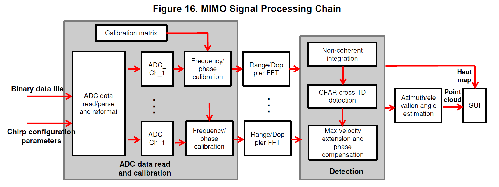
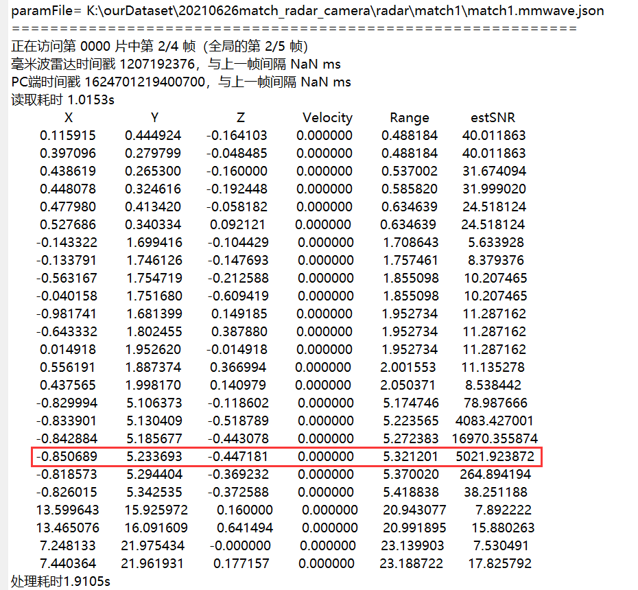
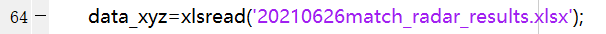

# TI-CASCADE-Radar-Processing

author: Fuyuan Ai

## 程序功能说明

主要分析脚本功能说明，后续会对各脚本的使用方法进行详细说明

### Aify_cascade_MIMO_signalProcessing_analyse.m功能说明

结合图片对原始adc数据进行分析，结果图如下图所示。
上部左图，标题时间戳为相机帧时间戳，采用UNIX16位时间戳（从第1位算起，第10位表示秒，13位表示毫秒，16位表示微秒），内容表示雷达生成点云在相机图像中的投影效果，颜色反应速度，白色点表示速度为0，偏蓝色点速度表示靠近雷达，偏红色点速度表示远离雷达。
上部中图表示当前帧+前9帧雷达点云的聚合效果。
上部右图表示当前帧Doppler Map。
下部左图表示当前帧Doppler Map的另一种图示方法，绿色粗线表示速度为0时分布在各距离维上的值，其他细线表示其他速度，黑色点表示CFAR算法在Doppler Map上检测到的点。
下部中图表示当前帧雷达点云效果。
下部右图表示当前帧雷达range-azimuth的热力图（只显示静态目标）

### Aify_cascade_MIMO_signalProcessing_genPointCloud.m功能说明

处理原始ADC数据，生成.mat格式点云文件

### Aify_cascade_MIMO_signalProcessing_view.m功能说明

仅依赖雷达ADC数据，显示雷达数据处理结果

左图表示当前帧Doppler Map的一种图示方法，绿色粗线表示速度为0时分布在各距离维上的值，其他细线表示其他速度，黑色点表示CFAR算法在Doppler Map上检测到的点。
上部右图表示当前帧Doppler Map
下部左图表示当前帧雷达range-azimuth的热力图（只显示静态目标）
下部右图表示当前帧雷达点云效果，颜色反应速度，白色点表示速度为0，偏蓝色点速度表示靠近雷达，偏红色点速度表示远离雷达

### Aify_matchPic.m

用处理好的.mat格式点云文件，结合图像，查看雷达与相机结合效果

### radar_camera_match_results文件夹

内为雷达相机标定程序，需配合Aify_cascade_MIMO_signalProcessing_view.m使用

## 运行前准备

1.	转至“$code/main/cascade”目录下
2.	运行add_paths.m文件
   需要将add_paths.m脚本中的第40行homeDir改为自定义的“$code”的路径

## Aify_cascade_MIMO_signalProcessing_analyse.m的使用方法

### 自定义修改部分

- 第8行：相机图片文件夹路径

  

- 第11至30行：想要查看分析的时间段，用相机时间戳表示
  起始时间戳imageTimestamp_start，默认为0
  结束时间戳imageTimestamp_end，默认为inf
  使用默认值可以观察所有图片的雷达点云投影情况。可以通过先观察相机图片，选择感兴趣的片段，记录图像时间戳（图像以时间戳命名）。
  这里我已经将重点数据段的时间戳标注出来。

  

- 35-45行：雷达相机标定矩阵
  标定矩阵时联系雷达坐标系和相机坐标系的关键参数，由实验测定
  20210428使用舟山标定矩阵
  20210513、0210514使用玉泉标定矩阵
  20210715使用logi摄像头与radar

  

- 49行：运行帧数，默认inf，表示查看几帧

- 51行：是否根据原始adc数据文件夹中的config.mmwave.json文件重新生成参数文件

- 53行：默认为1，开启时，每处理一帧点云会等待用户按键再运行下一帧

- 55行：表示聚合点云图的聚合帧数

  

- 79行：对应“$code/main/cascade/input”目录中的文件名，默认testList.txt”
  这个文件中：
  第一行表示雷达ADC数据文件夹路径，需要自定义
  第二行表示ADC校准mat路径，需要自定义
  第三行表示原始ADC数据文件夹中的config.mmwave.json文件重新生成参数文件的模板文件路径，默认就行

  

- 修改完毕点击运行即可

### 命令行输出

运行时，起初会根据设置的感兴趣的时间段，跳过一部分雷达数据。

跳转至感兴趣的部分开始处理，同时记录读取ADC数据时间和处理ADC数据时间

### 其他说明

radar ADC数据处理流程图

CFAR结果在第237行

DOA结果在294行

## Aify_cascade_MIMO_signalProcessing_view.m的使用方法

程序处理流程与Aify_cascade_MIMO_signalProcessing_analyse.m类似，这里不再详细赘述重复内容，只介绍有差异性内容。

### 自定义修改部分

- 第7-24行：根据需要设置功能参数。注意这里的abandonFirstFrame_ON功能为舍弃处理第一帧，原因在TI雷达手册中指出，采集数据的第一帧效果不佳，应适当舍弃。

  

- 第33行: “$code/main/cascade/input”目录中的文件名，默认testList_view.txt”
  这个文件中：
  第一行表示雷达adc数据文件夹路径，需要自定义
  第二行表示adc校准mat路径，需要自定义
  第三行表示原始adc数据文件夹中的config.mmwave.json文件重新生成参数文件的模板文件路径，默认就行

  

  

- 修改完毕点击运行即可，输出结果及对应场景如下图所示

  

  

  

## radar_camera_match_results（标定）的使用方法

1. 利用Aify_cascade_MIMO_signalProcessing_view.m脚本，查找当前帧中角反射器的位置，并记录在xlsx表格中

   

   

   

2. 利用文件夹中“PhotoPoint.m”脚本对图片中的角反射器进行标记。对每一张图标记时，注意：在角反射器位置处单击鼠标左键有且仅有1次，单后按enter键进行下一张标记，最终结果会以mat格式保存在当前文件夹中

   

   使用时仅需修改，图片文件夹路径Pic_path，文件夹中图片命名要求为“match1”、“match2”、……

   

3. 处理好radar和相机中角反射器的数据后，使用match_main.m脚本处理，生成radar坐标系与camera坐标系的转换矩阵。需要修改：

   - 57-59行：相机内参矩阵，可以通过matlab camera calibrator工具箱进行标定

     

   - 64行：加载radar中角反射器点位置记录xlsx文件路径

     

   - 65行：加载camera中角反射器位置记录mat’文件路径

     

   - 结果会保存在当前目录中，Hx.mat为radar坐标系与camera坐标系的转换矩阵（3×4维度矩阵），calibdata.mat为各标定组信息

     

   - show.m文件为生成的转换矩阵效果可视化

## 数据文件组织说明

以某一天的数据为例，文件组织及说明如下：

## Caozh_cascade_MIMO_signalProcessing.m使用说明

### 自定义修改部分

- 根据需求，修改"$code/main/cascade/Caozh_cascade_MIMO_signalProcessing.m"文件中第5-8行

  

- 修改"$code/main/cascade/Caozh_cascade_MIMO_signalProcessing.m"文件中第14行，调整为"$code"，例如：

  

- 根据"$code/main/cascade/Caozh_cascade_MIMO_signalProcessing.m"文件中第18行所指文件，如下图所示，为"$code/main/cascade/input/testList_caozh.txt"文件

  

  因此，修改"$code/main/cascade/input/testList_caozh.txt"文件，分别指定输入雷达原始数据文件夹路径（需修改）、校准mat文件（大多数情况下默认即可，当采样点数发生变化时才需要重新校准）、模板文件（默认即可），如下图所示：

  

- 点击运行按钮，即可运行程序。

  figure 1为rangeFFT图，plot一直处于hold on状态（使得不同组数据的rangeFFT曲线，可以绘制在一张图上），便于观察衰减情况

  

  查看rangeFFT图与range-azimuth图

  